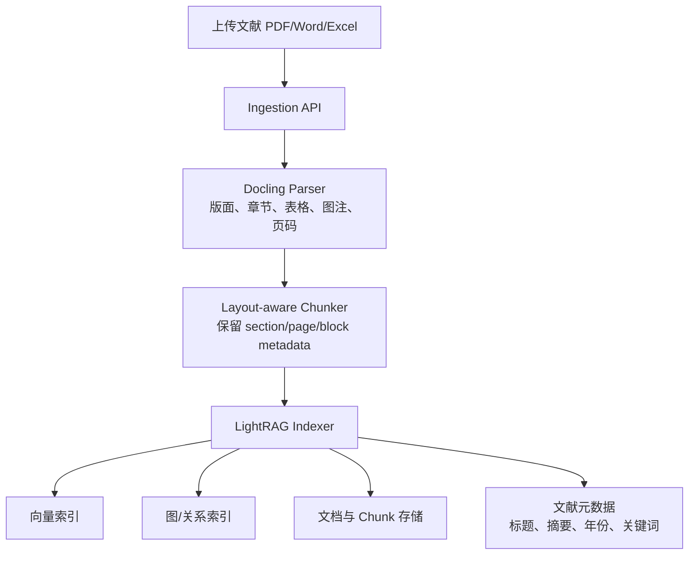

# SRA RAG 模块

文献解析与索引入库系统，基于 Docling 和 LightRAG 实现。

## 架构设计



## 功能特性

- **多格式文档解析**：支持 PDF、DOCX、XLSX、PPTX、HTML、Markdown 等格式
- **Layout-aware 智能分块**：按文档结构（章节、页面、区块）进行分块，保留丰富的元数据
- **双级检索系统**：结合向量检索和知识图谱检索
- **多种检索模式**：
  - `naive`: 简单向量检索
  - `local`: 局部知识图谱检索
  - `global`: 全局知识图谱检索
  - `hybrid`: 混合检索（推荐）

## 技术栈

- **Docling**: 文档解析和结构化
- **LightRAG**: 双级检索（向量 + 知识图谱）
- **LLM**: Qwen3-30B-A3B-GPTQ-Int4
- **Embedding**: bge-m3 (1024 维度)

## 快速开始

### 1. 统一入口

```python
from pathlib import Path
from sra_rag import SraRagOptions, create_sra_rag

options = SraRagOptions(
    working_dir="./rag_data",
    llm_base_url="http://your-api/v1",
    llm_api_key="your-api-key",
    llm_model="your-chat-model",
    embedding_model="your-embedding-model",
    embedding_dim=1024,
    max_token_size=8192,
)
rag = create_sra_rag(options)

# 解析文档
parsed_doc = rag.parser.parse(Path("paper.pdf"))

# 索引文档
doc_id = rag.indexer.index_document(parsed_doc)

# 检索
results = rag.retriever.retrieve("什么是图神经网络？", mode="hybrid")
print(results[0].content)
```

### 2. 直接构造底层组件

```python
from sra_rag import LightRAGIndexer, LightRAGRetriever

indexer = LightRAGIndexer(
    working_dir="./custom_rag_data",
    llm_base_url="http://your-api/v1",
    llm_api_key="your-api-key",
    llm_model="your-chat-model",
    embedding_model="your-embedding-model",
    embedding_dim=1024,
)
retriever = LightRAGRetriever(indexer)
```

### 3. 不同检索模式

```python
# 简单问答
result = retriever.retrieve("什么是机器学习？", mode="naive")

# 上下文相关问题
result = retriever.retrieve("为什么深度学习是机器学习的子集？", mode="local")

# 全局知识问题
result = retriever.retrieve("AI 技术的发展历程", mode="global")

# 混合检索（推荐）
result = retriever.retrieve("请解释 AI、ML、DL 的关系", mode="hybrid")
```

### 4. 批量处理

```python
from pathlib import Path

rag = create_sra_rag(options)

# 批量索引
doc_dir = Path("./documents")
for file_path in doc_dir.glob("*.pdf"):
    parsed_doc = rag.parser.parse(file_path)
    rag.indexer.index_document(parsed_doc)
```

## 模块结构

```
sra_rag/
├── __init__.py              # 模块导出
├── options.py               # 外部传入参数类型
├── factory.py               # 统一创建入口
├── parser/                  # 文档解析器
│   ├── __init__.py
│   ├── base.py             # 解析器抽象基类
│   └── docling_parser.py   # Docling 解析器
├── indexer/                 # 文档索引器
│   ├── __init__.py
│   ├── base.py             # 索引器抽象基类
│   └── lightrag_indexer.py # LightRAG 索引器
└── retrieval/               # 文档检索器
    ├── __init__.py
    ├── base.py             # 检索器抽象基类
    └── lightrag_retrieval.py # LightRAG 检索器
```

## 核心类说明

### ParsedDocument

解析后的文档对象，包含：
- `title`: 文档标题
- `content`: 结构化文本（Markdown）
- `metadata`: 文档元数据
- `chunks`: 分块列表（每个分块包含 text, section, page, block_type 等）

### DoclingParser

基于 Docling 的文档解析器：
- 支持多格式文档解析
- Layout-aware 智能分块
- 保留丰富的元数据（章节、页面、区块类型）

### LightRAGIndexer

基于 LightRAG 的索引器：
- 自动构建知识图谱
- 向量化索引
- 支持自定义 LLM 和 Embedding 模型

### LightRAGRetriever

基于 LightRAG 的检索器：
- 支持 4 种检索模式
- 返回结构化检索结果
- 支持带上下文的检索

## 参数说明

`sra_rag` 不读取项目内配置文件，也不读取环境变量。宿主项目负责管理运行参数，
然后组装成 `SraRagOptions` 传给 `create_sra_rag(...)`。同一个 options 对象也可以
作为 `sra_agent` 的 `llm_options` 使用。底层组件仍可直接显式传参。

## 数据存储

LightRAG 会在工作目录下生成以下文件：
- `kv_store_*.json`: 键值存储（文档、实体、关系等）
- `graph_chunk_entity_relation.graphml`: 知识图谱
- 其他索引文件

这些文件已添加到 `.gitignore`，不会被提交到版本控制。

## 注意事项

1. **首次索引时间较长**：LightRAG 需要提取实体和构建知识图谱
2. **Embedding 模型固定**：一旦开始索引，不能更改 Embedding 模型
3. **LLM 要求较高**：建议使用 32B 以上参数的模型，上下文长度至少 32K
4. **异步处理**：Embedding 生成使用异步请求，确保网络畅通
5. **实体关系抽取可能超时**：如果日志出现 `Task forcefully terminated due to execution timeout`，
   通常是 LightRAG 调用 LLM 抽取实体/关系时超时。可以降低 `--llm-max-async`、
   降低 `--chunk-token-size`，或提高 `--llm-timeout`。

## 示例代码

完整示例请查看：
- `examples/rag_usage_example.py`: RAG 基础用法
- `examples/embed_documents_example.py`: 文档解析和嵌入入库脚本，支持 `--embed-mode`

超时较多时可以这样运行：

```bash
uv run python examples/embed_documents_example.py resources/001_test.pdf \
  --embed-mode index \
  --working-dir ./sra_rag_data_test \
  --llm-base-url http://your-api/v1 \
  --llm-api-key your-api-key \
  --llm-model your-chat-model \
  --embedding-model your-embedding-model \
  --embedding-dim 1024 \
  --llm-timeout 600 \
  --llm-max-async 1 \
  --chunk-token-size 800 \
  --entity-extract-max-gleaning 0
```

## 依赖

- `docling>=2.95.0`
- `lightrag-hku>=1.4.16`
- `aiohttp`

## 开发

```bash
# 安装开发依赖
uv sync --extra dev

# 运行测试
pytest tests/ -v

# 代码格式化
black sra_rag/

# 类型检查
mypy sra_rag/
```

## 许可证

本项目遵循项目根目录下的许可证。
