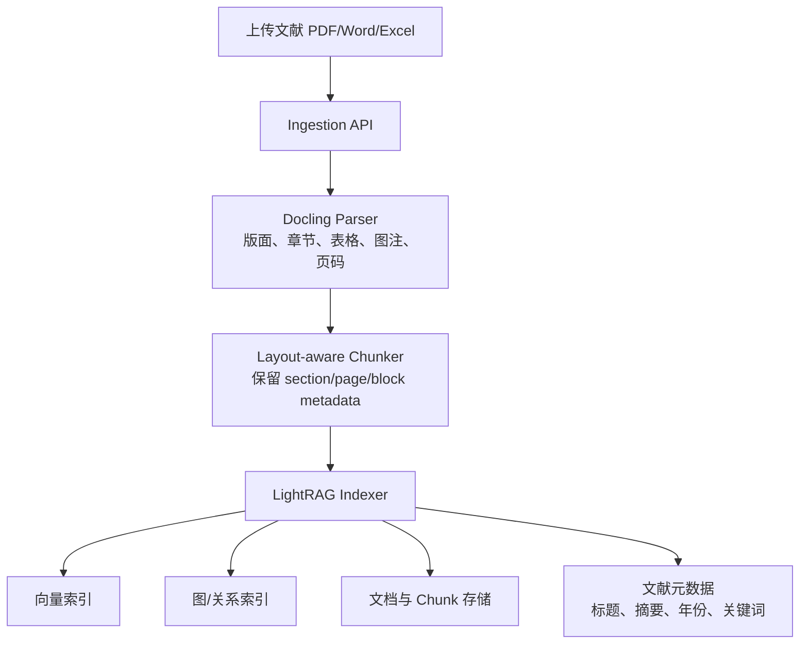

# SRA RAG 模块

文献解析与索引入库系统，基于 Docling 和 LightRAG 实现。

## 架构设计



## 功能特性

- **多格式文档解析**：支持 PDF、DOCX、XLSX、PPTX、HTML、Markdown 等格式
- **Layout-aware 智能分块**：按文档结构（章节、页面、区块）进行分块，保留丰富的元数据
- **双级检索系统**：结合向量检索和知识图谱检索
- **多种检索模式**：
  - `naive`: 简单向量检索
  - `local`: 局部知识图谱检索
  - `global`: 全局知识图谱检索
  - `hybrid`: 混合检索（推荐）

## 技术栈

- **Docling**: 文档解析和结构化
- **LightRAG**: 双级检索（向量 + 知识图谱）
- **LLM**: Qwen3-30B-A3B-GPTQ-Int4
- **Embedding**: bge-m3 (1024 维度)

## 快速开始

### 1. 基本使用

```python
from pathlib import Path
from sra_rag import DoclingParser, LightRAGIndexer, LightRAGRetriever

# 解析文档
parser = DoclingParser()
parsed_doc = parser.parse(Path("paper.pdf"))

# 索引文档
indexer = LightRAGIndexer(working_dir="./rag_data")
doc_id = indexer.index_document(parsed_doc)

# 检索
retriever = LightRAGRetriever(indexer)
results = retriever.retrieve("什么是图神经网络？", mode="hybrid")
print(results[0].content)
```

### 2. 自定义配置

```python
from sra_rag import RAGConfig, LightRAGIndexer

# 自定义配置
config = RAGConfig(
    working_dir="./custom_rag_data",
    llm_base_url="http://your-api/v1",
    llm_model="your-model",
    embedding_model="bge-m3",
    embedding_dim=1024,
)

# 使用自定义配置初始化索引器
indexer = LightRAGIndexer(
    working_dir=config.working_dir,
    llm_base_url=config.llm_base_url,
    llm_model=config.llm_model,
    embedding_model=config.embedding_model,
    embedding_dim=config.embedding_dim,
)
```

### 3. 不同检索模式

```python
# 简单问答
result = retriever.retrieve("什么是机器学习？", mode="naive")

# 上下文相关问题
result = retriever.retrieve("为什么深度学习是机器学习的子集？", mode="local")

# 全局知识问题
result = retriever.retrieve("AI 技术的发展历程", mode="global")

# 混合检索（推荐）
result = retriever.retrieve("请解释 AI、ML、DL 的关系", mode="hybrid")
```

### 4. 批量处理

```python
from pathlib import Path

parser = DoclingParser()
indexer = LightRAGIndexer()

# 批量索引
doc_dir = Path("./documents")
for file_path in doc_dir.glob("*.pdf"):
    parsed_doc = parser.parse(file_path)
    indexer.index_document(parsed_doc)
```

## 模块结构

```
sra_rag/
├── __init__.py              # 模块导出
├── config.py                # 配置管理
├── parser/                  # 文档解析器
│   ├── __init__.py
│   ├── base.py             # 解析器抽象基类
│   └── docling_parser.py   # Docling 解析器
├── indexer/                 # 文档索引器
│   ├── __init__.py
│   ├── base.py             # 索引器抽象基类
│   └── lightrag_indexer.py # LightRAG 索引器
└── retrieval/               # 文档检索器
    ├── __init__.py
    ├── base.py             # 检索器抽象基类
    └── lightrag_retrieval.py # LightRAG 检索器
```

## 核心类说明

### ParsedDocument

解析后的文档对象，包含：
- `title`: 文档标题
- `content`: 结构化文本（Markdown）
- `metadata`: 文档元数据
- `chunks`: 分块列表（每个分块包含 text, section, page, block_type 等）

### DoclingParser

基于 Docling 的文档解析器：
- 支持多格式文档解析
- Layout-aware 智能分块
- 保留丰富的元数据（章节、页面、区块类型）

### LightRAGIndexer

基于 LightRAG 的索引器：
- 自动构建知识图谱
- 向量化索引
- 支持自定义 LLM 和 Embedding 模型

### LightRAGRetriever

基于 LightRAG 的检索器：
- 支持 4 种检索模式
- 返回结构化检索结果
- 支持带上下文的检索

## 配置说明

### 默认配置

```python
working_dir = "./sra_rag_data"
llm_base_url = "http://211.90.240.240:30001/v1"
llm_model = "Qwen3-30B-A3B-GPTQ-Int4"
embedding_model = "bge-m3"
embedding_dim = 1024
```

### 环境变量

可以通过环境变量覆盖配置：
- `RAG_WORKING_DIR`: 工作目录
- `RAG_LLM_BASE_URL`: LLM API 地址
- `RAG_LLM_API_KEY`: LLM API 密钥
- `RAG_LLM_MODEL`: LLM 模型名称
- `RAG_EMBEDDING_MODEL`: Embedding 模型名称

## 数据存储

LightRAG 会在工作目录下生成以下文件：
- `kv_store_*.json`: 键值存储（文档、实体、关系等）
- `graph_chunk_entity_relation.graphml`: 知识图谱
- 其他索引文件

这些文件已添加到 `.gitignore`，不会被提交到版本控制。

## 注意事项

1. **首次索引时间较长**：LightRAG 需要提取实体和构建知识图谱
2. **Embedding 模型固定**：一旦开始索引，不能更改 Embedding 模型
3. **LLM 要求较高**：建议使用 32B 以上参数的模型，上下文长度至少 32K
4. **异步处理**：Embedding 生成使用异步请求，确保网络畅通

## 示例代码

完整示例请查看 `examples/rag_usage_example.py`

## 依赖

- `docling>=2.95.0`
- `lightrag-hku>=1.4.16`
- `aiohttp`

## 开发

```bash
# 安装开发依赖
uv sync --extra dev

# 运行测试
pytest tests/ -v

# 代码格式化
black sra_rag/

# 类型检查
mypy sra_rag/
```

## 许可证

本项目遵循项目根目录下的许可证。
